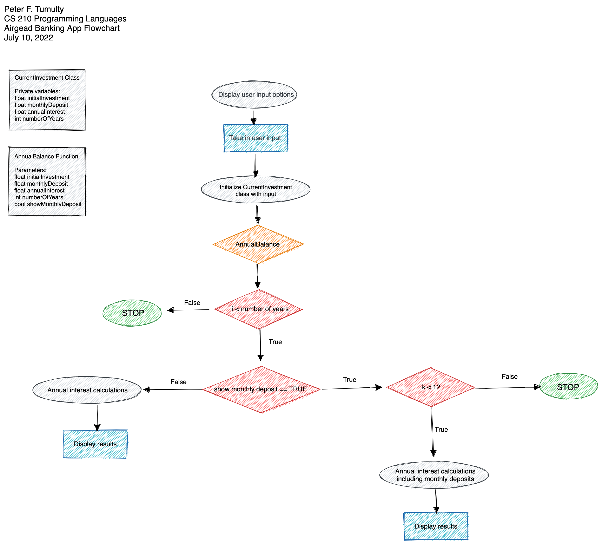

# Airgead Banking App

## Summary

This application will calculate the annual balance of an investment with or without monthly deposits.

## Well designed aspects

The logic that calculates the annual interest with and without monthly deposits is well designed.

## Areas of enhancement

The user interface could be improved. I imagine users will not want to interface with a banking application via the Terminal, but on a website or desktop applications. So an area of enhancement would be to build out either web application or a GUI around the core banking calculations logic.

## Challenges

The challenges of building this application where getting each one of these different functions in their own file and connecting them to the `main.cpp` file.

## Transferable skills

The transferable skills learned by designing this program is OOP using C++, working with and connecting multiple files, and designing programs with complex decision branches.

## Maintable, readable, adaptable

This program is maintainable, readable, and adaptable because it is designed with an object-oriented programming paradigm. 
